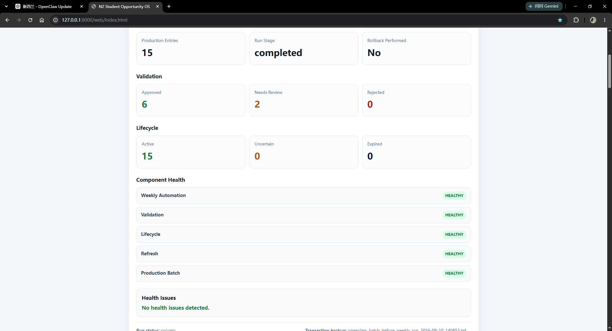

# NZ Student Opportunity OS

[](https://github.com/Eason99123/nz-opportunity-os/actions/workflows/ci.yml)


A local automation pipeline for discovering, validating, ranking, monitoring, and managing student opportunities for computer science students in Auckland, New Zealand.



## Latest Stable Release

```text
v1.0.0
```

This is the first stable, publicly demonstrable, and portfolio-ready release of NZ Student Opportunity OS.

## In 30 Seconds

NZ Student Opportunity OS is a local automation and monitoring system for finding and managing relevant student opportunities.

It combines:

* AI-assisted opportunity discovery
* deterministic Python processing
* validation and duplicate detection
* lifecycle management
* weighted ranking
* transaction-style rollback
* automated health monitoring
* continuous testing
* a local web dashboard
* a safe standalone demo mode

The system can run with OpenClaw for automated discovery, while the core Python pipeline can also be tested and demonstrated independently.

### Try the Demo

On Windows:

```text
run_demo.bat
```

Then open:

```text
http://127.0.0.1:8000/web/index.html
```

The demo uses safe sample opportunities and does not require private production data or OpenClaw credentials.

---

## Portfolio Summary

NZ Student Opportunity OS is a local automation and monitoring system for discovering, validating, ranking, and managing student opportunities for computer science students in Auckland.

The system combines AI-assisted discovery with a deterministic Python pipeline that performs validation, duplicate detection, lifecycle classification, ranking, rollback-safe updates, health monitoring, and dashboard generation.

The project currently includes:

* 45 automated tests
* GitHub Actions CI
* automated release safety checks
* production and demo modes
* transaction-style rollback
* lifecycle management
* validation and duplicate detection
* automated system health monitoring
* a local web dashboard
* safe sample data for public demonstration
* a stable v1.0.0 release

The public repository excludes private runtime data and local production files.

---

## Overview

The project was created to turn opportunity discovery into a repeatable engineering workflow.

Instead of manually searching for internships, workshops, student programmes, competitions, networking events, and other opportunities every week, the system processes discovered opportunities through a structured pipeline.

The pipeline aims to answer four questions:

1. Is this opportunity trustworthy enough to keep?
2. Is it still active?
3. How useful is it for a computer science student?
4. Is the system itself operating correctly?

The project therefore includes both opportunity-processing logic and operational reliability features.

---

## Current Status

Current public project status:

```text
Stable release               v1.0.0
Automated tests              45 passing
GitHub Actions               enabled
Release preflight            enabled
Standalone demo mode         available
Dashboard                    available
Validation pipeline          available
Lifecycle management         available
Health monitoring            available
Rollback support             available
```

---

## Architecture

```text
                    Opportunity Discovery
                    OpenClaw / External Input
                             |
                             v
                    Raw Opportunity Data
                             |
                             v
                        Cleaning
                             |
                             v
                        Validation
                  /           |           \
                 /            |            \
                v             v             v
           Approved      Needs Review    Rejected
                |
                v
         Production Batch
                |
                v
       Lifecycle Classification
          /        |        \
         /         |         \
        v          v          v
     Active     Uncertain   Expired
        |                     |
        |                     v
        |                  Archive
        v
     Ranking
        |
        v
       Export
        |
        v
  History Comparison
        |
        v
      Dashboard
        |
        v
   Health Monitoring
```

---

## Architecture Highlights

### Separation of Discovery and Processing

Opportunity discovery is separated from the deterministic Python processing pipeline.

OpenClaw can be used to discover opportunities, but validation, lifecycle classification, ranking, exporting, monitoring, and testing remain independent Python components.

This separation makes the system easier to:

* test
* debug
* demonstrate
* maintain
* extend

### Validation Pipeline

New opportunities are classified into:

* Approved
* Needs Review
* Rejected

Only approved opportunities are allowed to enter the production batch.

Validation logic also handles cases such as:

* weak source links
* generic search pages
* duplicate opportunities
* near duplicates
* suspicious or incomplete entries
* semantically distinct sessions
* different events with similar names

### Lifecycle Management

Existing opportunities are classified as:

* Active
* Uncertain
* Expired

The lifecycle system attempts to identify machine-verifiable dates and distinguish current opportunities from expired ones.

Expired opportunities are archived instead of silently deleted.

### Transaction Safety

Before production data is modified, the automation can create backups of the previous state.

If a later stage fails, the system can restore the previous production batch.

This protects the system from partial or inconsistent updates.

### Health Monitoring

The system monitors:

* weekly automation
* validation
* lifecycle processing
* refresh pipeline
* production batch

It also performs cross-checks between different components.

For example, lifecycle active counts are compared with production batch counts to detect inconsistent states.

### Demo Isolation

The repository includes a standalone demo environment.

Demo mode:

* uses safe sample opportunities
* generates its own runtime status
* does not depend on private production data
* does not require OpenClaw credentials
* still exercises the real core processing pipeline

The dashboard clearly labels demo mode so sample data cannot be confused with production data.

---

## Opportunity Scoring

Each opportunity can receive scores across five categories.

| Category       | Maximum |
| -------------- | ------: |
| Relevance      |       5 |
| Beginner Fit   |       5 |
| Career Value   |       5 |
| Practicality   |       5 |
| University Fit |       5 |
| Total          |      25 |

The final score is used to rank opportunities.

The ranking system is designed to prioritize opportunities that are relevant, accessible, practical, and useful for an early-stage computer science student.

---

## Validation

The validation stage checks discovered opportunities before they enter production.

Example classifications:

```text
Approved
Needs Review
Rejected
```

Examples of entries that may require review or rejection include:

* generic search result pages
* duplicate listings
* expired opportunities
* incomplete opportunities
* weak or unverifiable source links

The validation layer reduces the amount of unreliable AI-discovered information entering the production dataset.

---

## Duplicate Detection

The system includes duplicate detection for opportunity data.

The logic is designed to avoid treating every similar title as an exact duplicate.

For example, different sessions of the same programme can remain separate when their details show that they are distinct opportunities.

This reduces both:

* duplicate noise
* false-positive duplicate removal

---

## Lifecycle Management

Lifecycle management determines whether an existing opportunity is still useful.

Example states:

```text
Active
Uncertain
Expired
```

The lifecycle classifier supports explicit dates such as:

```text
21 October 2026
October 21, 2026
August 5-10, 2026
5-10 August 2026
```

It can also recognize ongoing opportunity markers such as:

```text
ongoing
recurring
open now
register of interest
```

Expired opportunities can be written to archive files.

---

## Ranking

Approved and active opportunities are ranked using the project scoring system.

The ranking pipeline is separated from discovery so ranking behavior can be tested independently.

This also makes it easier to change scoring rules without modifying opportunity discovery.

---

## Automation Safety

The weekly automation includes safety mechanisms designed to reduce the risk of corrupting production data.

Features include:

* pre-update transaction backups
* lifecycle backups
* failure stage tracking
* rollback status tracking
* production modification tracking
* failure injection testing

The project has been tested with deliberate automation failure scenarios to verify rollback behavior.

---

## System Health

The health monitoring layer combines information from multiple pipeline components.

Monitored components include:

```text
Weekly Automation
Validation
Lifecycle
Refresh
Production Batch
```

Health states include:

```text
HEALTHY
WARNING
UNHEALTHY
```

The health system performs consistency checks in addition to checking individual component status.

For example:

```text
Lifecycle active count
        compared with
Production batch entry count
```

A mismatch generates a health issue instead of silently passing.

---

## Dashboard

The local web dashboard provides a visual view of the system.

It displays:

* system health
* last weekly automation run
* last successful run
* run duration
* production entry count
* run stage
* rollback status
* validation results
* lifecycle results
* component health
* health issues
* opportunity cards
* scores
* source links
* filters
* favorites
* batch information
* refresh information

The dashboard also distinguishes between:

```text
Live backend data
```

and:

```text
Safe demo data
```

Demo mode displays a visible banner:

```text
DEMO MODE
Safe sample data is being used.
```

---

## Project Structure

```text
nz-opportunity-os/
│
├── .github/
│   └── workflows/
│       └── ci.yml
│
├── automation/
│   ├── run_weekly_automation.ps1
│   └── weekly_prompt.txt
│
├── docs/
│   └── dashboard.png
│
├── sample_data/
│   └── sample_opportunities.txt
│
├── src/
│   ├── append_openclaw_batch.py
│   ├── archive_expired_opportunities.py
│   ├── clean_openclaw_output.py
│   ├── cli.py
│   ├── exporter.py
│   ├── history_compare.py
│   ├── migrate_legacy_batch.py
│   ├── parser.py
│   ├── prune_published_batch.py
│   ├── ranking.py
│   ├── refresh_from_batch.py
│   ├── refresh_from_openclaw.py
│   ├── release_preflight.py
│   ├── remove_from_batch.py
│   ├── reset_openclaw_batch.py
│   ├── setup_demo.py
│   ├── update_input.py
│   ├── validate_opportunities.py
│   ├── write_automation_health.py
│   └── write_batch_status.py
│
├── tests/
│   ├── test_cli.py
│   ├── test_demo.py
│   ├── test_demo_ui.py
│   ├── test_exporter.py
│   ├── test_health.py
│   ├── test_lifecycle.py
│   ├── test_migration.py
│   ├── test_parser.py
│   ├── test_ranking.py
│   └── test_validator.py
│
├── web/
│   ├── index.html
│   ├── script.js
│   └── style.css
│
├── .gitignore
├── LICENSE
├── README.md
├── requirements.txt
├── run_demo.bat
├── run_weekly_automation.bat
└── start_local_server.bat
```

Runtime folders such as logs, incoming production files, generated opportunity outputs, backups, and archives are excluded from the public repository where appropriate.

---

## Requirements

Recommended environment:

```text
Python 3.11+
Windows 10 or Windows 11
```

Development dependency:

```text
pytest
```

Install dependencies:

```bash
python -m pip install -r requirements.txt
```

OpenClaw is required only for the automated opportunity discovery workflow.

The standalone demo and most Python components can be tested independently.

---

## Quick Start Demo

A safe standalone demo is included so the project can be explored without OpenClaw credentials or production opportunity data.

### Windows

Clone the repository:

```bash
git clone https://github.com/Eason99123/nz-opportunity-os.git
cd nz-opportunity-os
```

Install dependencies:

```bash
python -m pip install -r requirements.txt
```

Run:

```text
run_demo.bat
```

The demo will:

1. load safe sample opportunities
2. create a demo batch
3. run the refresh pipeline
4. generate ranked output
5. generate demo validation status
6. generate demo lifecycle status
7. generate system health information
8. start the local web server
9. open the dashboard

Dashboard URL:

```text
http://127.0.0.1:8000/web/index.html
```

---

## Running Tests

Run the full test suite:

```bash
python -m pytest -v
```

Current expected result:

```text
45 passed
```

The tests cover:

* parsing
* exporting
* ranking
* validation
* lifecycle classification
* migration
* system health
* CLI behavior
* demo safety
* demo UI integration

---

## GitHub Actions

GitHub Actions automatically runs CI on:

```text
push to main
pull request to main
```

The CI workflow performs:

```text
Repository checkout
Python setup
Dependency installation
Release preflight
Pytest
```

This helps detect regressions before new changes are accepted.

---

## Release Safety

Before publishing code, run:

```bash
python src/release_preflight.py
```

The release preflight checks public project files for potential issues such as:

* hard-coded Windows user paths
* API key patterns
* bearer tokens
* secret assignments
* sensitive credential files

A successful check reports:

```text
Release preflight PASSED.
```

---

## Release

The first stable release is:

```text
v1.0.0
```

Release status:

```text
Stable
45 tests passing
Release preflight passed
GitHub Actions passing
Standalone demo available
```

The release represents the first publicly demonstrable and portfolio-ready version of the project.

---

## Privacy and Runtime Data

Private runtime data is not intended to be committed to the public repository.

Examples include:

```text
logs/
incoming runtime files
production opportunity output
history output
archives
transaction backups
migration backups
lifecycle backups
environment files
```

The public repository includes safe sample data for demonstration instead.

---

## Running the Local Dashboard

Start the local server:

```text
start_local_server.bat
```

Or manually:

```bash
python -m http.server 8000
```

Then open:

```text
http://127.0.0.1:8000/web/index.html
```

---

## Weekly Automation

The production workflow can be launched through:

```text
run_weekly_automation.bat
```

The main PowerShell automation is:

```text
automation/run_weekly_automation.ps1
```

The workflow coordinates multiple stages including:

```text
Discovery
Cleaning
Validation
Publishing
Lifecycle processing
Refresh
Health monitoring
```

Production execution can depend on OpenClaw and local runtime configuration.

---

## Failure Testing

The automation includes support for deliberately testing failure scenarios.

This was used during development to verify that a failed stage does not leave production data in an inconsistent state.

A failure test can verify:

```text
failure stage detection
rollback execution
production restoration
health status changes
transaction backup behavior
```

This provides a way to test reliability behavior instead of assuming rollback works.

---

## Sample Data

Safe example opportunities are stored in:

```text
sample_data/sample_opportunities.txt
```

The sample data uses non-production example sources such as:

```text
example.com
```

It exists specifically for public testing and demonstration.

---

## Generated Outputs

During local operation, the project may generate files such as:

```text
deduplicated_ranked_output.json
opportunities.csv
weekly_summary.md
history snapshots
history change reports
validation status
lifecycle status
automation health status
batch status
refresh status
```

Many generated runtime files are excluded from Git.

---

## Engineering Goals

### Reliability

AI-assisted discovery is followed by deterministic processing and validation.

### Observability

The system records status information about major pipeline components.

### Recoverability

Production modifications can be protected using backups and rollback behavior.

### Testability

Core functionality is divided into separate modules with automated tests.

### Reproducibility

The public demo allows another user to run the project without access to private production data.

### Maintainability

Discovery, parsing, validation, lifecycle logic, ranking, exporting, health monitoring, and presentation are separated into different components.

---

## Key Engineering Concepts Demonstrated

The project demonstrates practical use of:

```text
Python
modular software design
data parsing
data validation
ranking algorithms
duplicate detection
file processing
JSON
CSV
automation
PowerShell
batch scripting
transaction-style rollback
health monitoring
system status reporting
HTML
CSS
JavaScript
Git
GitHub
GitHub Actions
Pytest
continuous integration
release safety
```

---

## Resume Ready Description

**NZ Student Opportunity OS**

Built a Python-based automation pipeline for discovering and managing student opportunities in Auckland, including validation, duplicate detection, lifecycle tracking, weighted ranking, rollback-safe updates, health monitoring, and a local web dashboard.

Implemented automated testing with Pytest, GitHub Actions CI, release safety checks, and a standalone public demo mode using safe sample data.

### CV Bullet Version

* Built a Python automation pipeline for discovering, validating, ranking, and lifecycle-managing student opportunities, with rollback-safe updates and automated health monitoring.
* Added 45 automated tests, GitHub Actions CI, release safety checks, and a standalone demo dashboard using safe public sample data.

---

## Interview Talking Points

### Why I Built It

I wanted a repeatable system for finding relevant student opportunities instead of manually searching multiple sources every week.

### Main Engineering Challenge

The main challenge was making an AI-assisted discovery workflow reliable enough for repeated use.

Raw discovered opportunities could contain:

* duplicates
* weak sources
* expired events
* incomplete dates
* generic search pages
* low-quality entries

I addressed this by placing deterministic validation, lifecycle, ranking, and health-checking stages after discovery.

### Why Discovery Is Separate

The discovery component can change independently from the rest of the system.

This means the core pipeline can still be tested even when OpenClaw or an external discovery service is unavailable.

### Reliability Design

The system creates backups before modifying production data.

A failed automation stage can restore the previous production state.

Health checks compare multiple pipeline outputs to detect inconsistent states.

### Example of a Real Detected Failure

During development, the health monitor detected a mismatch between lifecycle active entries and the production batch count.

The system reported a warning instead of silently treating the state as healthy.

This helped identify stale lifecycle runtime data in the demo workflow.

### Testing Strategy

The project currently has 45 automated tests covering:

* parsing
* ranking
* exporting
* validation
* lifecycle classification
* migration
* health monitoring
* CLI behavior
* demo safety
* demo UI integration

Tests run both locally and automatically through GitHub Actions.

### Demo Strategy

Private runtime data is excluded from the public repository.

A safe demo mode generates its own runtime state from sample opportunities and uses the same core processing pipeline.

This allows the project to be demonstrated without exposing production data.

---

## Future Work

Possible future improvements include:

* additional discovery providers
* improved semantic duplicate detection
* richer opportunity filtering
* configurable scoring weights
* database-backed storage
* scheduled notification delivery
* improved frontend visualization
* stronger end-to-end integration tests
* cross-platform automation scripts
* deployment of a read-only hosted demo

---

## Disclaimer

The project assists with opportunity discovery and organization.

Users should verify important details directly from the original opportunity source before applying, registering, traveling, or making financial commitments.

---

## Project Purpose

This project was built as both:

1. a practical system for finding relevant opportunities
2. a software engineering portfolio project

Its development focuses on building a system that is testable, observable, recoverable, and safe to demonstrate publicly.
